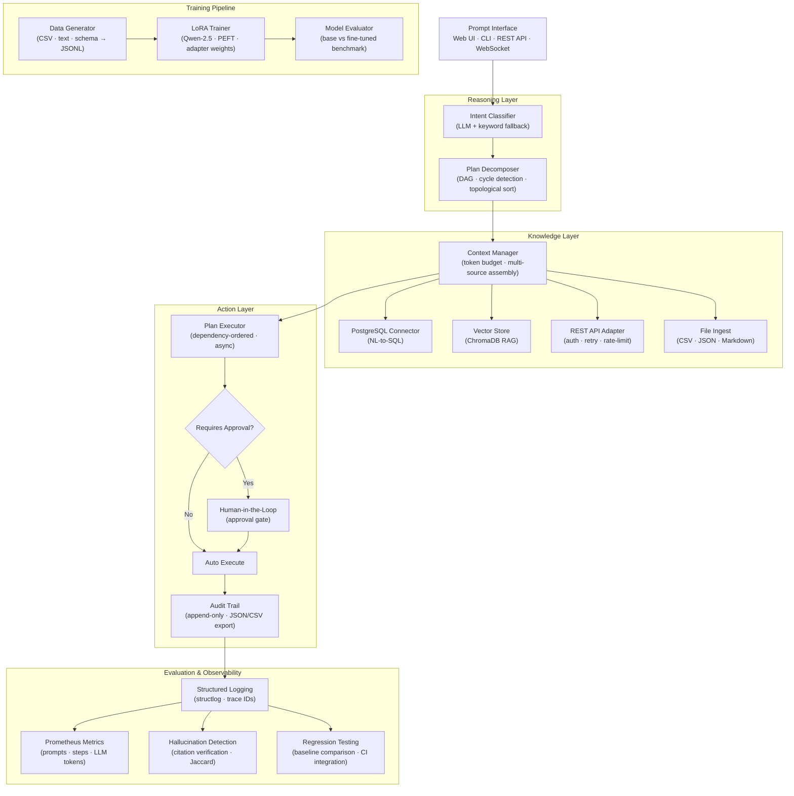

# Nexus — Enterprise AI Agent Orchestration Platform

Nexus is an open-source enterprise AI agent orchestration platform that unifies data sources, executes multi-step workflows from natural language prompts, and keeps humans in the loop for high-risk operations. Built as a proof-of-concept for agentic AI operating systems that run fully within a company's own environment.

[](https://github.com/ShamsRupak/nexus/actions/workflows/ci.yml)
[](https://www.python.org/)
[](LICENSE)
[](tests/)

---

## Architecture



---

## Features

- **Multi-step agent orchestration** — DAG-based planning with dependency resolution, parallel execution of independent steps, cycle detection
- **Enterprise data connectors** — PostgreSQL (NL-to-SQL with injection protection), REST APIs (OAuth/API-key/bearer, retry with backoff), ChromaDB vector store (RAG), CSV/JSON/Markdown file ingestion
- **Human-in-the-loop** — action plans require approval before execution; every plan carries a risk classification (LOW / MEDIUM / HIGH / CRITICAL)
- **LoRA fine-tuning pipeline** — generates 200+ instruction pairs from enterprise data, fine-tunes Qwen-2.5 with PEFT adapter weights, benchmarks fine-tuned vs base
- **Evaluation framework** — accuracy scoring (Jaccard + embedding cosine), hallucination detection via citation verification, regression suite for CI
- **Full observability** — structured JSON logging with trace ID propagation, Prometheus metrics (prompts, steps, LLM tokens, connectors), Grafana dashboards
- **Append-only audit trail** — every agent action is recorded with input/output summaries, timestamps, connector, risk level; exportable as JSON or CSV
- **React web interface** — real-time execution timeline via WebSocket, plan preview with per-step approval toggles, audit panel, data source health indicators
- **Local-first** — no data leaves your environment; all models, databases, and APIs run within your own infrastructure

---

## Demo Scenarios

| Prompt | Intent | Connector | Approval? |
|---|---|---|---|
| `"Show me all deals over $100K"` | query | PostgreSQL (NL-to-SQL) | No |
| `"How many high priority tickets are open?"` | query | PostgreSQL | No |
| `"Onboard new customer Acme Corp"` | workflow | PostgreSQL + REST API | **Yes** |
| `"What is our refund policy?"` | query | ChromaDB (RAG) | No |

**Example output — query:**
```
User:  Show me all deals over $100K

Nexus: Found 8 deals over $100,000:

  | Company         | Value      | Stage       | Owner          |
  |-----------------|------------|-------------|----------------|
  | Stark Industries| $250,000   | Closed Won  | Lena Müller    |
  | Umbrella Corp   | $180,000   | Negotiation | Marcus Rivera  |
  | Initech         | $145,000   | Proposal    | Sarah Chen     |
  | ...             |            |             |                |

  Total pipeline value above threshold: $1,847,500
```

**Example output — workflow with approval gate:**
```
User:  Onboard new customer Acme Corp

Nexus: ⚠  This plan requires approval (MEDIUM risk)

  Step 1  create_customer_record      postgres
  Step 2  provision_workspace         rest_api
  Step 3  send_welcome_email          rest_api
  Step 4  schedule_onboarding_call    rest_api

  [ Approve All ]  [ Reject ]
```

---

## Tech Stack

| Layer | Technology |
|---|---|
| **Language** | Python 3.11+ |
| **API** | FastAPI + Uvicorn + WebSockets |
| **Frontend** | React 19 + TypeScript + Vite + Tailwind CSS |
| **LLM** | OpenAI-compatible (gpt-4o-mini default) + Qwen-2.5 via PEFT/LoRA |
| **Vector store** | ChromaDB (EphemeralClient in tests, persistent in prod) |
| **Relational DB** | PostgreSQL 16 via SQLAlchemy (asyncpg) |
| **Observability** | structlog + Prometheus client + Grafana |
| **Fine-tuning** | HuggingFace Transformers + PEFT (LoRA) + Datasets |
| **Testing** | pytest + pytest-asyncio + Starlette TestClient |
| **Infrastructure** | Docker Compose · GitHub Actions CI |

---

## Quick Start

```bash
# Clone and install
git clone https://github.com/ShamsRupak/nexus.git
cd nexus
pip install -e ".[dev]"

# Run the demo (no external services needed — uses keyword fallbacks)
python scripts/demo.py

# Full stack with Docker
cp .env.example .env           # add OPENAI_API_KEY if you have one
docker compose up

# Run tests
pytest -v
```

The demo runs four enterprise scenarios without any external API keys or database connections — the system gracefully falls back to keyword-based intent classification and template-based responses.

---

## API Reference

| Method | Endpoint | Description |
|---|---|---|
| `POST` | `/api/v1/prompt` | Submit a natural-language prompt for execution |
| `POST` | `/api/v1/approve/{plan_id}` | Approve a pending plan and execute it |
| `GET` | `/api/v1/plans` | List recent plans with status (`?limit=N`) |
| `GET` | `/api/v1/plans/{plan_id}` | Get full plan detail including step timeline |
| `GET` | `/api/v1/audit` | Query audit trail (`?trace_id`, `?action_type`, `?since`) |
| `GET` | `/api/v1/audit/export` | Export audit trail (`?fmt=json` or `?fmt=csv`) |
| `GET` | `/api/v1/connectors` | List registered connectors and capabilities |
| `GET` | `/api/v1/health` | Service health check |
| `GET` | `/metrics` | Prometheus metrics endpoint |
| `GET` | `/api/v1/eval/report` | Run built-in regression suite |
| `WS` | `/ws` | WebSocket for real-time execution streaming |

**WebSocket event stream:**

```json
{"event": "classifying"}
{"event": "intent_classified", "intent": "query", "requires_approval": false}
{"event": "planning"}
{"event": "plan_created", "plan_id": "...", "step_count": 3}
{"event": "step_started", "step_id": "...", "tool": "postgres"}
{"event": "step_completed", "step_id": "...", "duration_ms": 12.4}
{"event": "plan_completed", "answer": "Found 8 deals matching your criteria."}
```

---

## Module Architecture

| Module | Description | Key Files |
|---|---|---|
| `nexus/core/` | Reasoning engine — intent, planning, execution | `intent.py`, `planner.py`, `executor.py`, `types.py` |
| `nexus/connect/` | Data connectors and context assembly | `registry.py`, `postgres.py`, `rest_api.py`, `vector_store.py`, `file_ingest.py`, `context.py` |
| `nexus/train/` | LoRA fine-tuning pipeline | `data_generator.py`, `lora_trainer.py`, `evaluator.py` |
| `nexus/eval/` | Evaluation framework | `scorer.py`, `citation.py`, `regression.py` |
| `nexus/observe/` | Observability layer | `logger.py`, `metrics.py`, `audit.py` |
| `nexus/api/` | FastAPI backend | `main.py`, `routes.py`, `ws.py` |
| `frontend/src/` | React web interface | `App.tsx`, `components/`, `hooks/` |
| `scripts/` | CLI tools | `demo.py`, `seed_data.py` |

---

## Model Training

The LoRA fine-tuning pipeline converts proprietary enterprise data into training pairs and adapts a base model without modifying its weights:

```
1. Generate training data
   python -c "
   from nexus.train.data_generator import TrainingDataGenerator
   gen = TrainingDataGenerator()
   n = gen.generate_all('data/sample', 'data/train.jsonl')
   print(f'Generated {n} training pairs')
   "

2. Fine-tune with LoRA
   from nexus.train.lora_trainer import LoRATrainer, TrainingConfig
   import asyncio

   trainer = LoRATrainer(config=TrainingConfig(
       model_name="Qwen/Qwen2.5-3B-Instruct",
       lora_r=16, epochs=3
   ))
   dataset = asyncio.run(trainer.prepare_dataset("data/train.jsonl"))
   result  = asyncio.run(trainer.train(dataset, "models/adapters/v1"))

3. Benchmark against base
   from nexus.train.evaluator import ModelEvaluator
   evaluator = ModelEvaluator()
   report = asyncio.run(evaluator.benchmark(
       base_model="Qwen/Qwen2.5-3B-Instruct",
       adapter_path="models/adapters/v1",
       test_cases=[...]
   ))
   print(f"Improvement: {report.improvement_pct:+.1f}%")

4. Adapter weights only (~50MB vs 6GB full model)
   → Deploy by pointing LoRATrainer at your adapter_path
   → Swap adapters per customer/department without retraining
```

**Why LoRA:** Parameter-efficient — only ~0.1% of parameters are trained. Adapters are tiny (~50 MB), can be swapped per customer/use-case, and the base model weights never change.

---

## Evaluation Framework

```python
from nexus.eval.scorer import score_response
from nexus.eval.citation import verify_citations
from nexus.eval.regression import RegressionRunner

# Score a response against ground truth
result = score_response(
    response="There are 12 deals in Negotiation with total value $1.8M.",
    ground_truth="12 deals in Negotiation stage, $1.8M total value.",
    expected_fields=["12", "Negotiation", "1.8M"],
    expected_format="text",
)
# result.accuracy=0.87, result.completeness=1.0, result.overall=0.95

# Detect hallucinations
report = verify_citations(
    response="The refund window is 30 days.",
    source_documents=["Nexus offers a 30-day money-back guarantee..."],
)
# report.hallucination_rate=0.0, report.grounded=1

# Regression testing in CI
runner = RegressionRunner()
runner.add_case("query_deals", "show me all deals", {"intent": "query"})
report = asyncio.run(runner.run_all())
# Fails CI if regressions detected vs baseline
```

---

## Security Model

| Control | Implementation |
|---|---|
| **Data sovereignty** | All models, DBs, and APIs run within your own environment — no external calls required |
| **Audit trail** | Every agent action is logged with input/output summaries, connector, risk level, and timestamp |
| **Human approval** | All mutating operations (create, update, delete, workflows) require explicit human approval |
| **Risk classification** | Every plan carries a risk level (LOW / MEDIUM / HIGH / CRITICAL) computed from intent + entities |
| **SQL injection protection** | PostgreSQL connector validates all generated SQL against allowlist patterns before execution |
| **Read-only by default** | PostgreSQL connector defaults to read-only mode; mutations require explicit opt-in flag |
| **Trace ID propagation** | Every request carries a UUID trace ID through all log entries, metrics, and audit records |

---

## Testing

**207 tests across 10 test files — all passing.**

| Test file | Tests | What it covers |
|---|---|---|
| `test_intent.py` | 16 | Intent classification, keyword fallback, risk levels |
| `test_planner.py` | 15 | DAG decomposition, cycle detection, topological sort |
| `test_executor.py` | 8 | Step execution, dependencies, timeouts, approval flow |
| `test_connectors.py` | 34 | PostgreSQL NL-to-SQL, REST API adapter, vector store, file ingest |
| `test_context.py` | 14 | Multi-source context assembly, token management, truncation |
| `test_observe.py` | 22 | Structured logging, Prometheus metrics, audit trail |
| `test_eval.py` | 31 | Scorer, citation/hallucination detection, regression runner |
| `test_api.py` | 19 | All REST endpoints + WebSocket streaming |
| `test_train.py` | 25 | Data generator (CSV/text/schema/JSONL), LoRA config, evaluator |
| `test_integration.py` | 13 | End-to-end pipeline, approval flow, WebSocket events |

```bash
pytest -v                          # all 207 tests
pytest tests/test_integration.py  # end-to-end pipeline only
pytest -k "websocket"             # WebSocket tests only
```

---

## Design Decisions

**1. DAG-based planning instead of linear chain**

Complex enterprise workflows have inherent parallelism — e.g., "fetch customer data" and "check account balance" can run simultaneously before "generate summary". A linear chain wastes latency. The DAG executor resolves dependencies with Kahn's topological sort and runs independent steps concurrently with `asyncio.gather`.

**2. Keyword fallback alongside LLM**

The LLM classifier is the default, but the keyword fallback activates when the API key is absent, the LLM is rate-limited, or `NEXUS_ENV=test`. This gives zero-latency responses for common patterns, prevents total failure under API outages, and makes the test suite fast without mocking network calls.

**3. LoRA, not full fine-tuning**

Full fine-tuning a 3B-parameter model requires 24+ GB VRAM and produces a 6 GB artifact per customer. LoRA trains only ~0.1% of parameters (the attention projection matrices), produces ~50 MB adapter weights, and keeps the base model frozen so you can serve one base model with many adapters swapped in/out per request.

**4. Human-in-the-loop by design**

Enterprise software that autonomously mutates production databases without a human review step will not get deployed. Every plan that touches write operations presents a full step-by-step preview with risk level before execution. The approval gate is not optional — it's a first-class architectural primitive.

**5. Local-first architecture**

Enterprise AI adoption is blocked by data sovereignty concerns: legal, compliance, and security teams will reject any system that sends customer data to a third-party cloud. Nexus is designed to run entirely within a company's own VPC — the LLM can be swapped for a locally-hosted model (Ollama, vLLM), and all connectors talk to internal systems.

---

## What's Not Implemented

This is a proof-of-concept. The following are known gaps for a production system:

- **Multi-tenant isolation** — single-tenant POC; no row-level security or tenant-scoped data access
- **Real OAuth2 connector flows** — Salesforce, Jira, HubSpot integrations use mock REST adapters
- **GPU-optimized inference serving** — no vLLM or TGI integration; LoRA training requires local GPU
- **Model versioning and A/B testing** — no model registry or shadow traffic routing
- **Role-based access control** — no user roles, no per-connector permission scoping
- **WebSocket authentication** — WS endpoint has no auth middleware in the POC
- **Streaming LLM responses** — `response_chunk` event type is defined but the current executor returns complete answers
- **Database migrations** — schema is managed manually; no Alembic migration chain

---

## License

MIT — see [LICENSE](LICENSE).

---

*Built with Python 3.11, FastAPI, React, and a lot of asyncio.*
